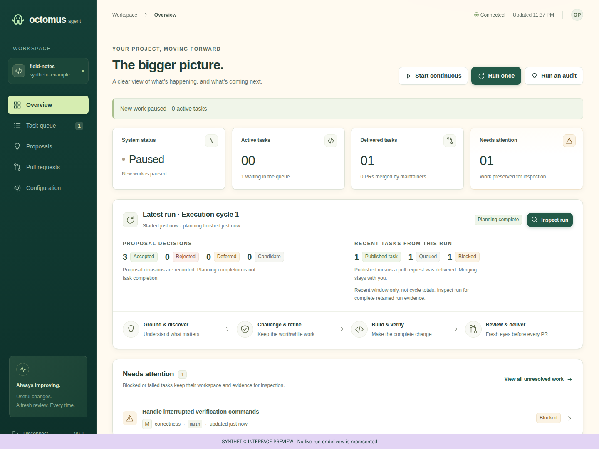

# Octomus Agent

Octomus finds useful improvements in a repository, challenges them with two
independent reviewers, and delivers verified pull requests through Codex. It can
reject every proposal and do nothing. Think **Dependabot, with features**: you
choose the repository and boundaries; it discovers the work. Delivery stops at a
PR for you to review and merge.



*This image uses synthetic browser-test data.*

## Getting started

**Release preparation:** binaries and the crates.io package have not been
published yet. The release installer below becomes usable after publication;
use the source-build alternative today. See [distribution](docs/distribution.md)
for packaging and publication instructions.

Use a dedicated Ubuntu 24.04 VM (x86_64 or aarch64), an existing paid Codex account,
and a dedicated GitHub identity with access restricted to the target repository.
Do not use your workstation or put unrelated credentials on the VM. Account
creation, owner-approved authentication and VM provisioning must already be
arranged; login is performed by you.

### 1. Install the tools and application

As the VM administrator, install Git, gh, curl and OpenSSL. This npm-based Codex
installation uses Node 22 from [NodeSource](https://github.com/nodesource/distributions)
and the pinned [Codex release](https://github.com/openai/codex/releases/tag/rust-v0.153.4).
Octomus's binary itself does not require Node or Rust at runtime.

```bash
sudo apt-get update
sudo apt-get install -y git gh curl ca-certificates openssl
curl -fsSL https://deb.nodesource.com/setup_22.x -o /tmp/octomus-node22.sh
sudo bash /tmp/octomus-node22.sh
sudo apt-get install -y nodejs
sudo npm install -g @openai/codex@0.153.4
```

After Octomus releases are published, install the latest stable binary in one command:

```bash
curl -fsSL https://raw.githubusercontent.com/tyk-swe/octomus-agent/main/install.sh | sh
```

The installer verifies the downloaded archive against release SHA-256 checksums
and installs to `/usr/local/bin`. To select a version, download the script and run
`sh install.sh v0.1.0`; an alternate writable absolute destination is supported
through `INSTALL_DIR`. Checksums detect corruption; they are not independent
signatures against a compromised release account.

**Source-build alternative, available now:** add Rust 1.88+ and a C compiler,
then build the dashboard before Rust. Python is only needed for repository tests.

```bash
sudo apt-get install -y build-essential
curl --proto '=https' --tlsv1.2 -sSf https://sh.rustup.rs -o /tmp/octomus-rustup.sh
sh /tmp/octomus-rustup.sh -y --profile minimal
. "$HOME/.cargo/env"
git clone https://github.com/tyk-swe/octomus-agent.git
cd octomus-agent
npm ci --prefix web
make build
sudo install -m 755 target/release/octomus-agent /usr/local/bin/octomus-agent
```

`cargo install octomus-agent --locked` will be another option after crates.io
publication. The crate includes the built dashboard; end users won't need npm to
build that package. See [distribution](docs/distribution.md) for release preparation.

### 2. Connect as the service user

Create a dedicated account without sudo access and a persistent checkout location:

```bash
sudo useradd --create-home --home-dir /var/lib/octomus --shell /bin/bash octomus
sudo install -d -o octomus -g octomus /srv/projects
sudo -iu octomus
codex login
gh auth login
gh auth setup-git
```

Use the dedicated identity and repository-restricted authentication arrangement,
not an unrelated personal credential. As this same user, replace the sample
repository identity and clone it. Configure Git identity if your project requires it.

```bash
git clone https://github.com/OWNER/REPOSITORY.git /srv/projects/project
export OCTOMUS_TOKEN="$(openssl rand -hex 32)"
printf '%s\n' "$OCTOMUS_TOKEN"
```

Save this token in your password manager; it grants operator access. Confirm paid
overage is disabled for subscription-only operation. Then start the service:

```bash
octomus-agent --data-dir /var/lib/octomus/.octomus
```

From your own computer, forward the dashboard port (replace `your-vm` with the
VM's SSH destination):

```bash
ssh -N -L 4200:127.0.0.1:4200 your-vm
```

Open **http://127.0.0.1:4200**, enter your saved token, and keep the service running
in the VM terminal. It starts paused. Refreshing the page requires the token again.

### 3. Run an audit, then a cycle

In **Configuration**, enter `/srv/projects/project`, `OWNER/REPOSITORY`, the default
branch, and an owned branch prefix. For this repository use `tyk/`; the general
product default is `octomus/`.

Use **Load available models** and select the exact model and effort for the
orchestrator, discovery agents and proposal reviewers. Save, then **Check audit
connection**. Unsupported routes fail visibly; explicitly select available routes
instead of expecting a fallback. Correct any CLI version warning before live work.

Select **Run an audit** while paused and idle. It runs one planning pass, retains
accepted/rejected/deferred decisions, queues nothing, and leaves execution paused.
Read the **Proposals** view, select the audit and inspect its reasons. With nine
discovery agents, a completed pass normally consumes 13 session admissions; it is
not free. Audit agents still run unsandboxed.

For an executing cycle, install your target project's build/test tools, choose the
code reviewer, five execution tier routes and repair route, and enter meaningful
verification commands (one shell command per line). For Octomus itself, install
Rust/rustfmt/clippy, Node 22.12+, Python 3 and Playwright prerequisites, then use:

```bash
npm ci --prefix web && make check && make test
```

Start conservatively: one concurrent task, one task per cycle and a 21,600-second
interval. This is a conservative starting profile, not a measured replacement for
shipped defaults. Save and **Check connection**, then **Run a cycle**. This enables
ongoing cycles as well. Inspect the task's review/verification evidence and PR;
only you decide to merge it. A cycle with no worthwhile work is a valid outcome.

**Pause** stops new work; active tasks may finish and publish. Use **Cancel task**
to stop an individual task, or stop the service to terminate its workers. Audits
cannot start alongside active work. For durable service setup, follow
[deployment](docs/deployment.md) and the [operator checklist](docs/operations.md).

## How it decides

Grounding inspects code, AGENTS.md, history and existing owned PRs, including
their review state, check results, mergeability and recent comments, so
requested changes, red CI or conflicts on an Octomus PR become work. Eight to ten
discovery agents explore complementary areas; two independent adversaries
challenge their proposals. The orchestrator records a reason for every decision.
Optional operator guidance in **Configuration** (for example, areas to leave alone
or a current priority) is appended to every planning prompt as authoritative
policy; repository content remains evidence only.
An execution cycle queues accepted work; an audit only records recommendations.
A later execution cycle plans afresh, rather than executing an old audit result.

Each task has its own execution thread and checkout. Every code review uses a
**fresh reviewer** and the **complete accumulated diff**. Repairs use one
**persistent repair thread** per task. Configured verification must pass on the
reviewed revision before Rust publishes or updates a PR. Interrupted work and
publication are reconciled from durable state. See [architecture](docs/architecture.md).

## What a day costs

**Live cost measurements are pending.** Session admissions are not dollars or a
subscription-allowance cap. Default idle planning normally uses 13 admissions per
completed cycle, and the shipped daily limit is 150; retries and tasks consume
more. Use existing subscription allowance only, with no paid overage.
[Cost methodology and measurement tables](docs/cost.md) distinguish observations,
unavailable attribution, subscription fees and incremental charges.

## Security

The dedicated VM is the sandbox: Codex and verification commands have the service
user's permissions, and repository prompt injection is not prevented by design.
Keep the single-operator dashboard on loopback behind SSH, with a random private
token and repository-restricted GitHub authentication. Read the
[threat model](docs/threat-model.md) before running work; report vulnerabilities
privately to **mail@mail.tyk.sh** using [SECURITY.md](SECURITY.md).

## Contributing

Octomus is Codex-only, single-operator and single-repository. See
[contributing](CONTRIBUTING.md), [changelog](CHANGELOG.md),
[configuration example](docs/configuration.example.json), and
[acceptance coverage](docs/acceptance.md). License: [Apache-2.0](LICENSE).
