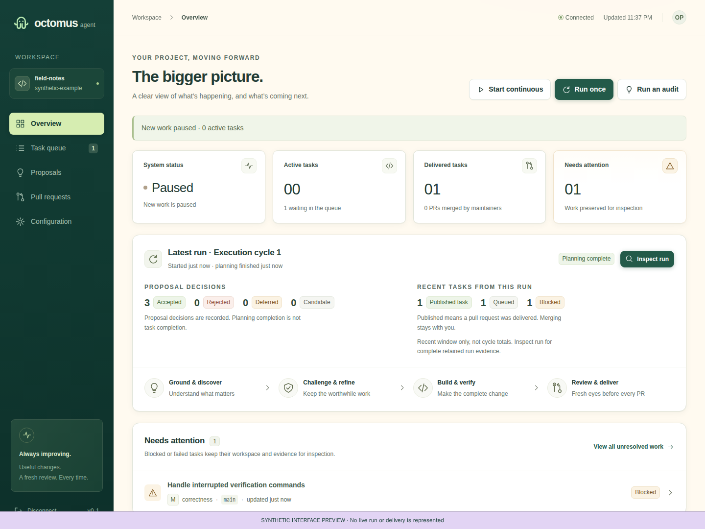

# Octomus Agent

[](https://github.com/tyk-swe/octomus-agent/actions/workflows/ci.yml)
[](LICENSE)

**Your repo’s next improvement. Ready for review.**

Octomus finds useful improvements in your repository, challenges them with two independent
reviewers, and turns accepted work into reviewed, verified pull requests through Codex or
OpenCode. It can reject every proposal and do nothing. You decide what merges.

**Self-hosted preview · Sandboxed by default · One operator · One repository · Your Codex or OpenCode access**



*This image uses synthetic browser-test data.*

## How it decides

Grounding inspects code, `AGENTS.md`, history and existing owned pull requests, with
bounded, source-attributed contributor and fork context to help identify overlapping
work. External pull requests are never writable targets, and recorded coverage names
omitted or truncated context.

Eight to ten discovery agents explore complementary areas; two independent adversaries
challenge their proposals. The orchestrator records a reason for every decision. An
execution cycle queues accepted work; an audit only records recommendations, and a later
execution cycle plans afresh rather than executing an old audit result.

Each task gets its own execution thread and checkout. Every code review uses a **fresh
reviewer** and the **complete accumulated diff**. Repairs use one **persistent repair
thread** per task. Configured verification must pass on the reviewed revision before
Octomus publishes or updates a pull request. Interrupted work and publication are
reconciled from durable state.

## Sandboxed by default

Every agent turn and every verification command runs in its own short-lived container:
- non-root, with no capabilities and a read-only image;
- seeing only its task's work tree and read-only git history;
- with no GitHub credential;
- with no route out except an HTTPS allowlist you control.

The control plane, which holds your GitHub token and Octomus state, never runs repository
code. Only a small broker with no network touches the Docker socket. **Check connection**
proves all of this from inside a real sandbox before any work starts.
Read the [sandbox guide](docs/sandbox.md).

## Getting started

You need a Linux host with Docker Engine 28 or later (a VPS you already run is fine), your
own Codex or OpenCode provider access, and a GitHub fine-grained token limited to the one
target repository.

```sh
git clone https://github.com/tyk-swe/octomus-agent.git
cd octomus-agent/deploy/docker
./setup.sh                                               # checks Docker, asks for OWNER/REPO and the token, starts the stack
docker compose run --rm login codex login --device-auth  # or: opencode auth login, once .env allows its hosts
ssh -N -L 4200:127.0.0.1:4200 your-host                  # then open http://127.0.0.1:4200
```

The dashboard listens on loopback and starts paused. The first run is four explicit
moves: enter the configuration, save it, check the connection (which runs the sandbox
self-test), then choose **Run an audit** or **Run once**. Start with an audit to inspect
recommendations without queuing code changes. A later execution run plans afresh.

VM and provider costs depend on your setup. Session admissions are operating limits,
not dollar caps; validated per-task and daily cost figures are not available yet.

**[Full installation and first-run walkthrough →](docs/getting-started.md)**

## Documentation

| Document | What it covers |
| --- | --- |
| [Getting started](docs/getting-started.md) | Prerequisites and the first run |
| [Configuration](docs/configuration.md) | Repository, routes, checks, and operating limits |
| [Architecture](docs/architecture.md) | Cycle, task and review contracts; storage and trust |
| [Model routing](docs/model-routing.md) | Per-role Codex and OpenCode selection |
| [Configuration example](docs/configuration.example.json) | Every saved policy field with its shipped default |
| [Sandbox](docs/sandbox.md) | What isolation guarantees, how to prove it, what it does not cover |
| [Deployment](docs/deployment.md) | Docker Compose, the installer and unsandboxed VM, controls, limits, backup, HTTP API |
| [Run evidence](docs/run-evidence.md) | What `RunEvidenceV1` reports, and what it never claims |
| [Cost](docs/cost.md) | What a session admission is, and what is not measured |
| [Threat model](docs/threat-model.md) | Trust boundaries, prompt injection, redaction limits |
| [Releasing](https://github.com/tyk-swe/octomus-agent/blob/main/docs/releasing.md) | Packaging and release workflow |

## Security

Repository content and model output are untrusted, and prompt injection is not prevented by
design. The [sandbox](docs/sandbox.md) keeps what it can do away from your credentials, your
host and the rest of the internet; review, verification and your merge decision remain the
gate on what ships. Keep the single-operator dashboard on loopback behind SSH, with a random
private token and a repository-restricted GitHub token. Read the
[threat model](docs/threat-model.md) before running work, and report vulnerabilities
privately to **mail@mail.tyk.sh** using [SECURITY.md](SECURITY.md).

## Contributing

Octomus runs on Codex or OpenCode, single-operator and single-repository. See
[contributing](https://github.com/tyk-swe/octomus-agent/blob/main/CONTRIBUTING.md), the [changelog](CHANGELOG.md) and the
[configuration example](docs/configuration.example.json). For questions and reproducible
bugs, use [GitHub issues](https://github.com/tyk-swe/octomus-agent/issues).

License: [Apache-2.0](LICENSE).
